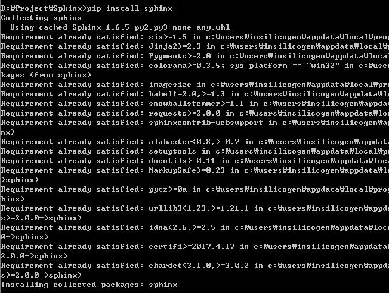
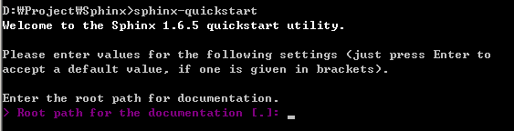
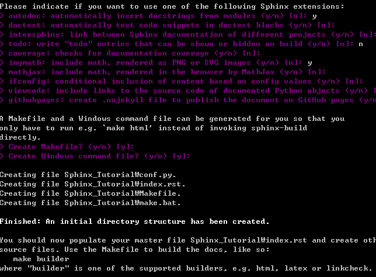
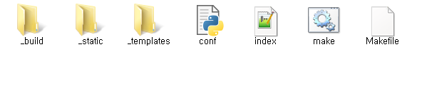
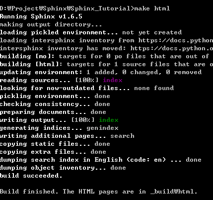
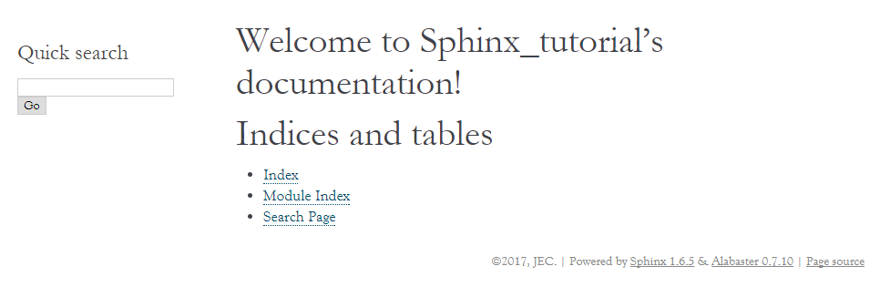
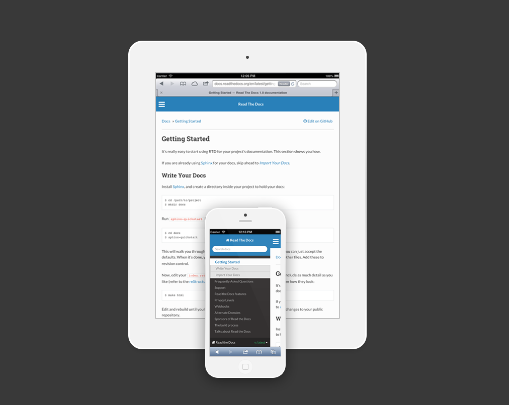
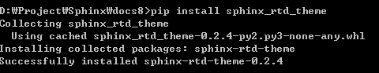
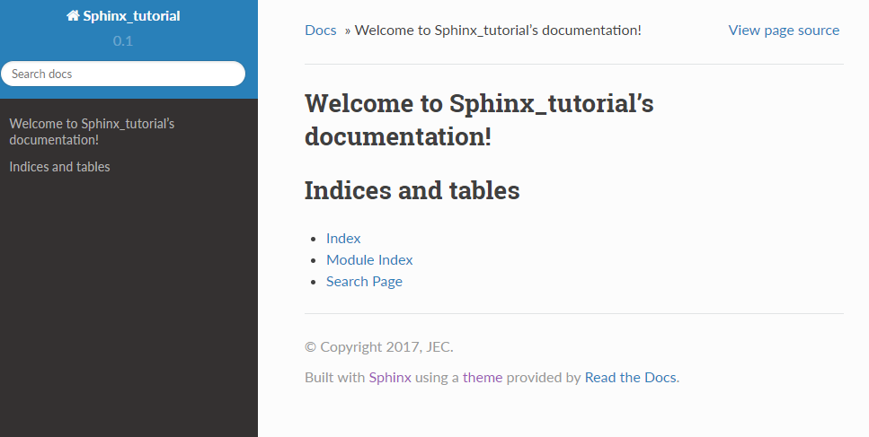

============================
Introduce
============================

01. 스핑크스란?
---------------------------------
스핑크스는 문서를 쉽게 생성할 수 있는 툴로써 다음과 같은 특징이 있다.

#. **출력 포맷** : HTML, LaTaX, ePub, 텍스트 정보, 설명서, 계획서
#. **다양한 상호참조** : 기능, 인용, 용어집 등을 위한 시멘틱 마크업, 자동 링크.
#. **계층 구조** : 문서를 쉽게 생성할 수 있고 자동으로 링크됨.
#. **코드 핸들링** : 자동 하이라이팅 기능
#. **확장성** : 문서에 파이썬 코드를 추가하거나 로딩 가능. 
#. **기여** : PyPI를 통해 다양한 다양한 기능들 추가 가능.

|

02. 스핑크스 설치
---------------------------------
cmd 창을 열고 ``pip install sphinx`` 명령을 입력하고 실행.

.. note:: 
   - 설치 : pip install sphinx
   - 삭제 : pip uninstall sphinx

|
	
03. 기본 문서 만들기
---------------------------------
cmd 창에서 원하는 폴더로 이동후 ``sphinx-quickstart`` 명령을 실행.
문서를 생성하기 위한 몇 가지 질문들이 나오고 원하는 값을 입력. [ ]의 값은 기본값이며 엔터를 치면 기본값이 입력됨.

.. note:: 
	- 문서 만들기 : shpinx-quickstart

	

Root path for the documentation [.] 
	- 루트 디렉토리 지정, 입력값이 없으면 현제 폴더에 생성.	
	- Sphinx_Tutorial (Sphinx_Tutorial 폴더를 루트로 지정)
Separate source and build directories (y/n) [n]
	- 별도의 소스, 빌드 디렉토리 생성
	- n (한 폴더에 빌드와 소스 폴더가 생성.)
Name prefix for templates and static dir [_]
	- static 폴더의 접두사를 정함.
	- _(static 폴더 앞에 _이 붙어 _static이 된다.)
Project name:
	- 프로젝트 이름을 정함
	- Sphinx_tutorial
Author name(s):
	- 저자 이름 
	- JEC
Project version []:
	- 버젼 설정 
	- 0.1 (버전을 0.1로 설정)
Project release [0.1]:
	- 릴리즈 버젼을 설정
	- 0.1 (릴리즈 버젼을 0.1로 설정)
Project language [en]:
	- 프로젝트 주 사용 언어 설정
	- en (영어를 주언어로 설정)
Source file suffix
	- 소스 파일의 확장자를 설정
	- rst (확장자를 rst로 설정)
Name of your master document (without suffix) [index]:
	- 마스터 문서의 이름을 설정
	- index (마스터 문서 이름이 index로 설정)
Do you want to use the epub builder (y/n) [n]:
	- ePub 빌더 사용 여부 결정
	- n 
autodoc: automatically insert docstrings from modules (y/n) [n]:
	- 자동으로 모듈에서 문자 삽입 
	- y (인덱스에서 모듈명 입력시 자동으로 모듈을 생성)
doctest: automatically test code snippets in doctest blocks (y/n) [n]:
	- 자동으로 코드 발췌를 사용 
	- n 
intersphinx: link between Sphinx documentation of different projects (y/n) [n]:
	- 다른 스핑크스 문서끼리 연결
	- y
todo: write "todo" entries that can be shown or hidden on build (y/n) [n]:
	- todo를 보여줄 지 결정
	- n
coverage: checks for documentation coverage (y/n) [n]:
	- 문서 커버리지 검사 
	- n
imgmath: include math, rendered as PNG or SVG images (y/n) [n]:
	- PNG와 SVG를 위한 math, rendered를 첨부
	- y
mathjax: include math, rendered in the browser by MathJax (y/n) [n]:
	- 브라우저에 MathJax로 math, rendered를 첨부
	- n
ifconfig: conditional inclusion of content based on config values (y/n) [n]:
	- 설정값을 기준으로 조건부를 포함.
	- n
viewcode: include links to the source code of documented Python objects (y/n) [n]:
	- 파이썬 객체 문서의 링크를 포함.
	- n
githubpages: create .nojekyll file to publish the document on GitHub pages (y/n)
	-  깃허브에서 출력가능한 nojekyll 파일을 만듬
	- n
Create Makefile? (y/n) [y]:
	- make 파일을 생성
	- y (make 파일을 간편하게 빌드 가능)
Create Windows command file? (y/n) [y]:
	- 윈도우 명령 파일을 생성
	- y
	
|

04. 생성된 문서 확인.
---------------------------------
위 설정을 완료하면 Sphinx_Tutorial 폴더가 생성됨.

	
생성된 폴더에는 아래처럼 구성되 있음.

|

05. HTML 생성
---------------------------------
cmd에서 루트 폴더로 이동후 ``make html`` 명령 실행. conf.py 내용을 기반으로 html을 생성. 생성되는 경로는 '_bulid' 폴더 안의 'html' 폴더에 생성됨.

.. note:: 
	- root 폴더로 이동후 make html
	- 앞으로 문서를 수정하면 make html 명령을 실행해서 수정된 내용을 적용

- HTML 문서를 생성하는 과정

- 생성된 HTML 문서들

|
	
05. 루트 인덱스 문서 실행
---------------------------------
_bulid 폴더 안의 html 폴더 안에 index.html을 실행시 메인 페이지가 열림. 인터넷 브라우저로 실행 가능.

- 처음 실행하는 인덱스 페이지

	
|

06. 테마 적용
---------------------------------
Sphinx에서 자체적으로 제공하는 테마가 있지만 여기서는 'Read the Docs Sphinx Theme' 테마를 적용함.

	
`sphinx_rtd_theme Git Hub <https://github.com/rtfd/sphinx_rtd_theme/>`_.

적용할 테마를 다운받아 설치하기 위해 cmd 창에 ``pip install sphinx_rtd_threme`` 실행한다. 

.. note:: 
	- 설치 : pip install sphinx_rtd_threme
	- 삭제 : pip uninstall sphinx_rtd_threme

	
루트 디렉토리에서 conf.py 파일을 에디터로 열고 아래와 같이 수정.

	- 상단에 ``import sphinx_rtd_theme`` 추가하여 테마를 불러옴.
	- 중간부분에 ``html_theme="sphinx_rtd_theme"`` 으로 수정하여 테마를 지정.
	- 그리고 ``html_theme_path = [sphinx_rtd_theme.get_html_theme_path()]`` 추가해서 경로를 지정해줌.

루트 디렉토리의 conf.py 파일 수정

.. literalinclude:: ./conf.py
   :language: python
   :linenos:
   :emphasize-lines: 3
   :lines: 20-25

.. literalinclude:: ./conf.py
   :language: python
   :linenos:
   :emphasize-lines: 4,7
   :lines: 89-98

수정하고 cmd창에서 ``make html``로 빌드를 실행. 그리고 _bulid/html의 index.html을 실행하면 수정된 테마를 확인 가능.

