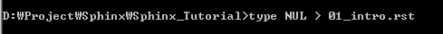
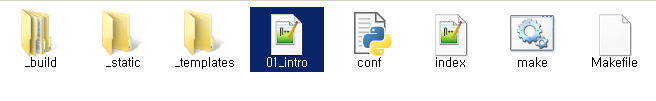
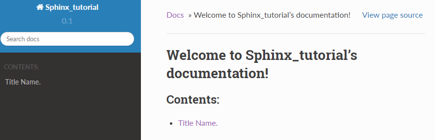
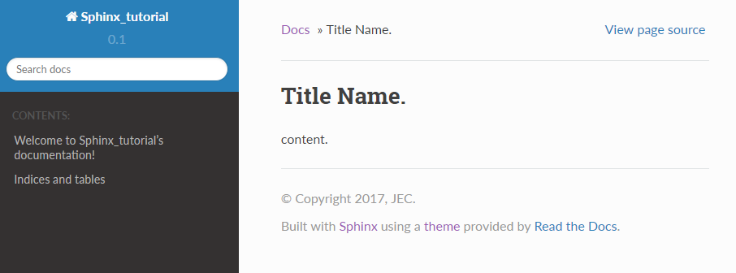

============================
Module
============================

01. 빈 RST 만들기
---------------------------------
모듈 문서를 만들기 위해 우선 빈 RST 파일을 생성. cmd 창에서 루트 디렉토리로 이동후 ``type NUL > 모듈명.rst`` 명령을 실행.

.. note:: 
	- 여기서는 모듈명을 Intro로 지정.
	- type NUL > Intro.rst

	
그러면 루트 디렉토리에 새로운 rst파일이 생성된 것을 확인 가능.

|

02. 타이틀 입력
---------------------------------
새로 생성된 RST파일을 편집기로 열고 타이틀을 입력.

.. warning:: 
	- 타이틀이 없으면 빌드중 오류 발생.

Intro.rst 내용: ::

	============================
	Title Name
	============================

	content.
	
|

03. 모듈 빌드하기
---------------------------------
index.rst에 새로 생성한 모듈명(파일이름)을 추가. ::

	Welcome to Sphinx_tutorial's documentation!
	===========================================

	.. toctree::
	   :maxdepth: 2
	   :caption: Contents:
	   
	   Intro

그리고 cmd 창에서 새로 빌드(make html)해주면 추가된 모듈을 확인 가능.

새로 생성된 모듈을 클릭하면 입력했던 내용을 볼 수 있음.

