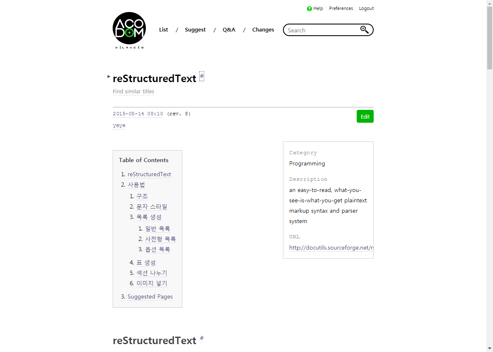
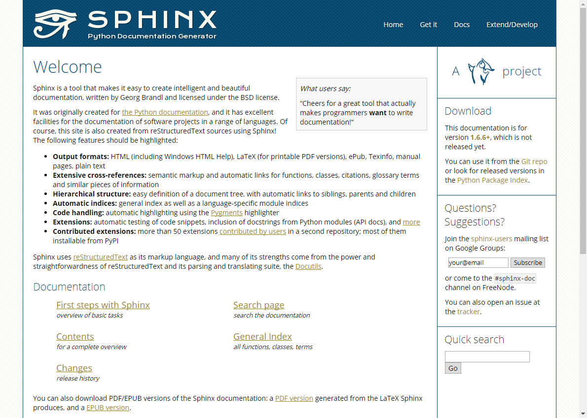
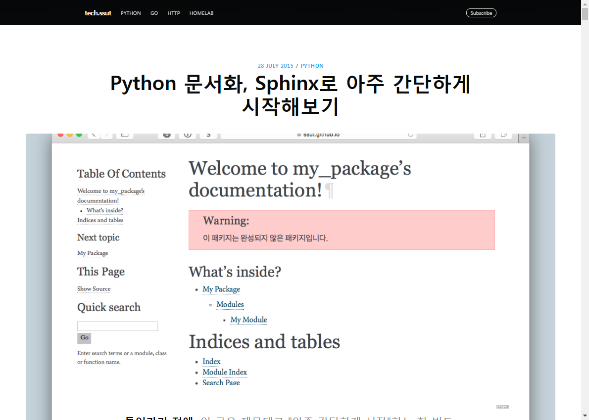
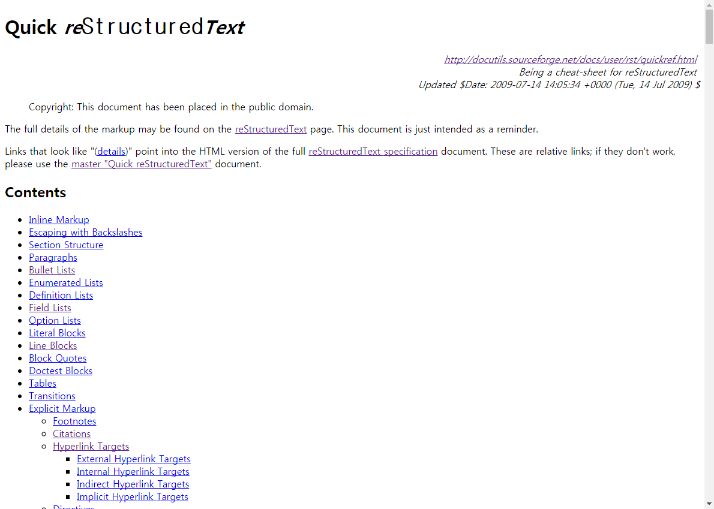
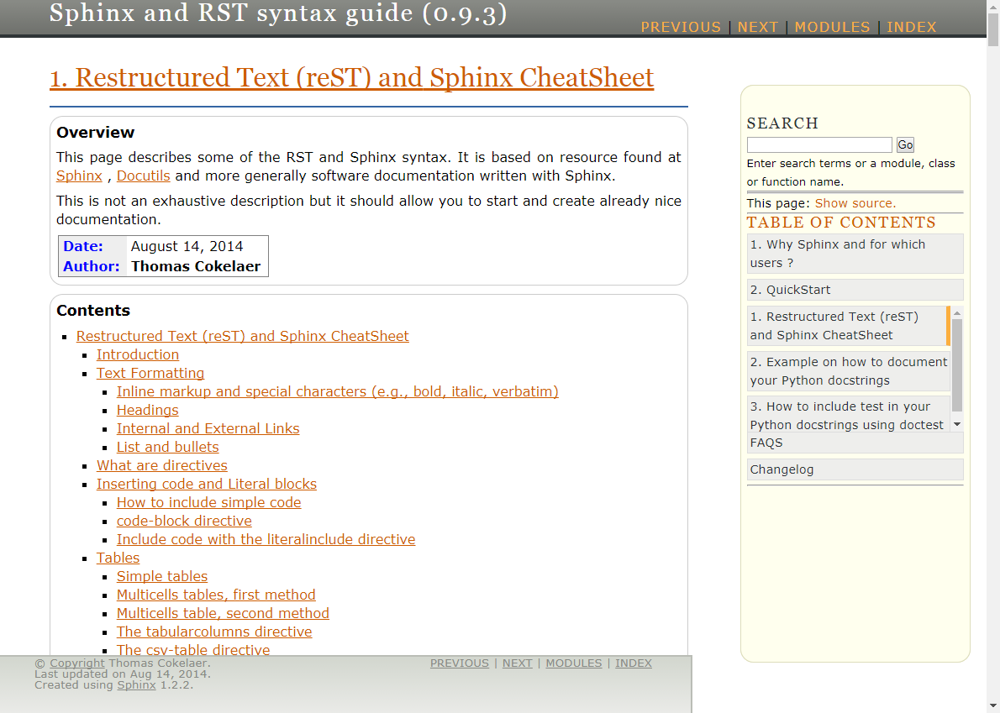

=================
Reference
=================

01 IncoDOM - reStructuredText
^^^^^^^^^^^^^^^^^^^^^^^^^^^^^^
reStructuredText에 대한 개요와 사용방법을 예제로 설명.
http://www.incodom.kr/reStructuredText

| 

02 Sphinx Document
^^^^^^^^^^^^^^^^^^^^^^^^^^^^^^
스핑크스 정식 사이트로 전반적인 내용 수록.
http://www.sphinx-doc.org/en/stable/index.html

| 

03 Python 문서화, Sphinx로 아주 간단하게 시작해보기
^^^^^^^^^^^^^^^^^^^^^^^^^^^^^^^^^^^^^^^^
초보자를 위한 스핑크스 가이드. 낮은 버젼이라 최신 버전과 다른 점들이 있음.
https://tech.ssut.me/2015/07/28/start-python-documentation-using-sphinx/

| 

04 Quick reStructuredText
^^^^^^^^^^^^^^^^^^^^^^^^^^^^^^^^^^^^^^^^
reStructuredText 다양한 사용법을 예제와 같이 수록. 
http://docutils.sourceforge.net/docs/user/rst/quickref.html#bullet-lists

| 

05 Sphinx and RST syntax guide (0.9.3)
^^^^^^^^^^^^^^^^^^^^^^^^^^^^^^^^^^^^^^^^
reStructuredText 다양한 사용법과 스핑크스의 숨겨진 기능들 소개.
https://thomas-cokelaer.info/tutorials/sphinx/rest_syntax.html#images-and-figures

